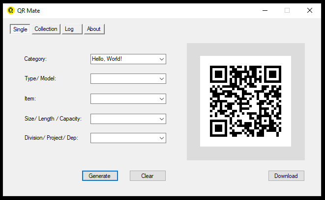
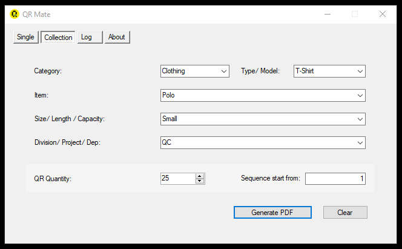
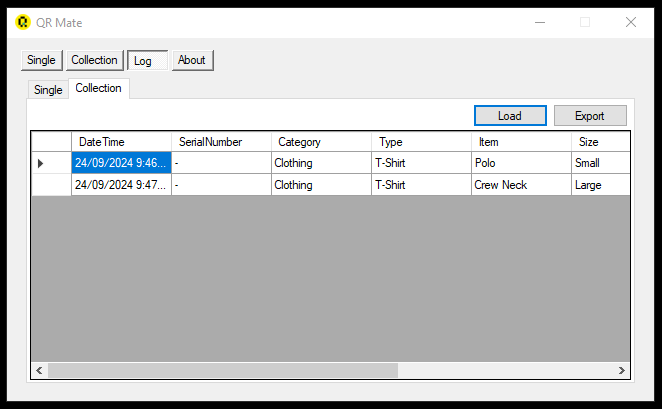

# QRMate-QR-Code-Generator

## Overview

The **QR Code Generator** is a simple and efficient desktop application developed in C#. This tool allows users to generate QR codes for mainly asset management and various types of data, for other purposes including URLs, text, and contact information. The application is designed to be user-friendly and provides a seamless experience for creating and saving QR codes.

## Screenshot

<p align="middle">
  
 </p>

 <p align="middle">
  
 </p>

 <p align="middle">
  
 </p>


## Features

- **Easy QR Code Generation**: Generate QR codes for asset management, URLs, text, and more with just a few clicks.
- **Customizable Output**: Save QR codes in different formats such as PNG, JPEG, and BMP.
- **User-Friendly Interface**: Intuitive and straightforward interface for a smooth user experience.
- **Lightweight and Fast**: Quick generation of QR codes without any lag.

## Getting Started

### Prerequisites

- .NET Framework 4.7.2 or higher
- Visual Studio 2019 or later

### Installation

1. **Clone the Repository**:
   ```bash
   https://github.com/SASHTEK/QRMate-QR-Code-Generator-App.git

2. **Open the Solution**:
   - Open the QR Master.sln file in Visual Studio.
     
3. **Restore NuGet Packages**:
   - Restore the NuGet packages by right-clicking on the solution in Solution Explorer and selecting “Restore NuGet Packages” or by running the following command in the Package Manager Console:
     
     ```base
     Update-Package -reinstall
4. Copy "QRMateData" folder into C: drive in your computer.

5. Include you data in the "data_source" Excel file like its order (example) to get the data into dropdown menus in the application.

## Contributing
We welcome contributions! Please fork the repository and submit pull requests for any improvements or bug fixes.

## License
This project is licensed under the MIT License - see the LICENSE file for details.
